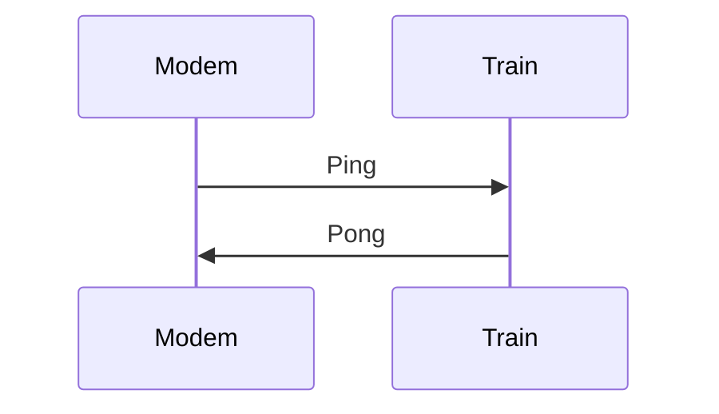
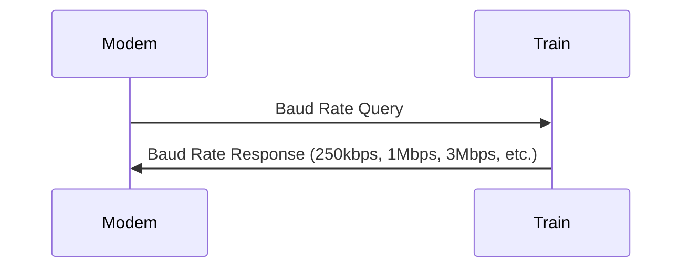
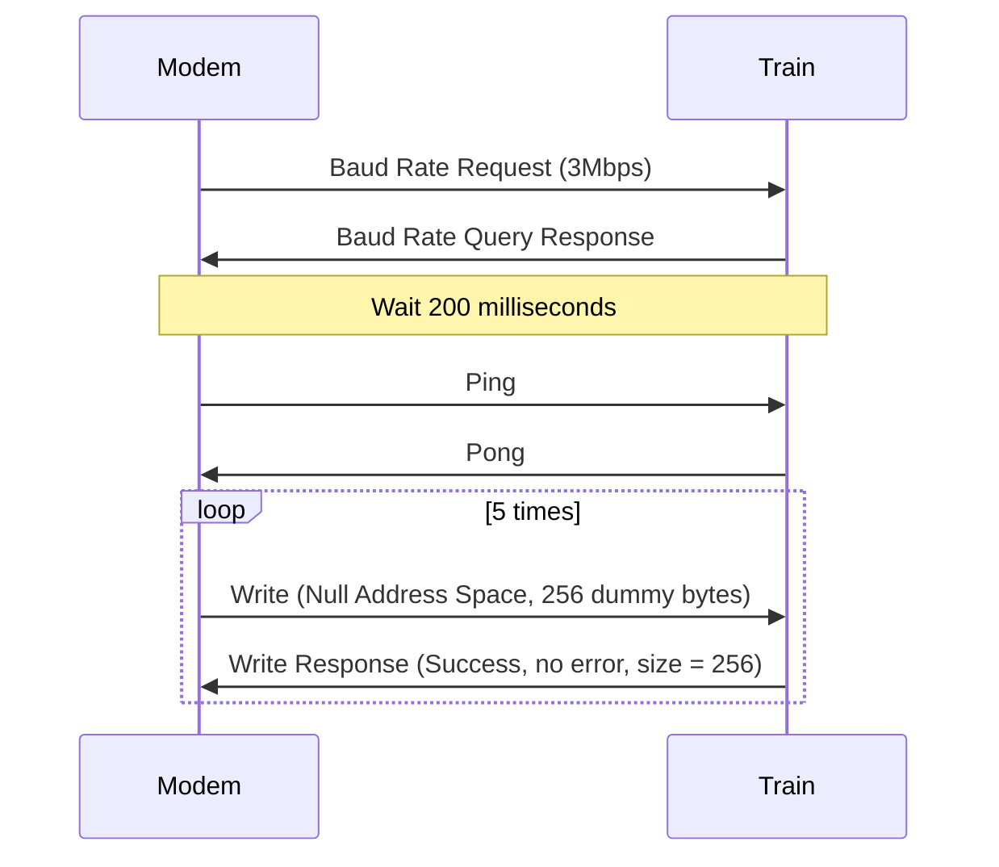
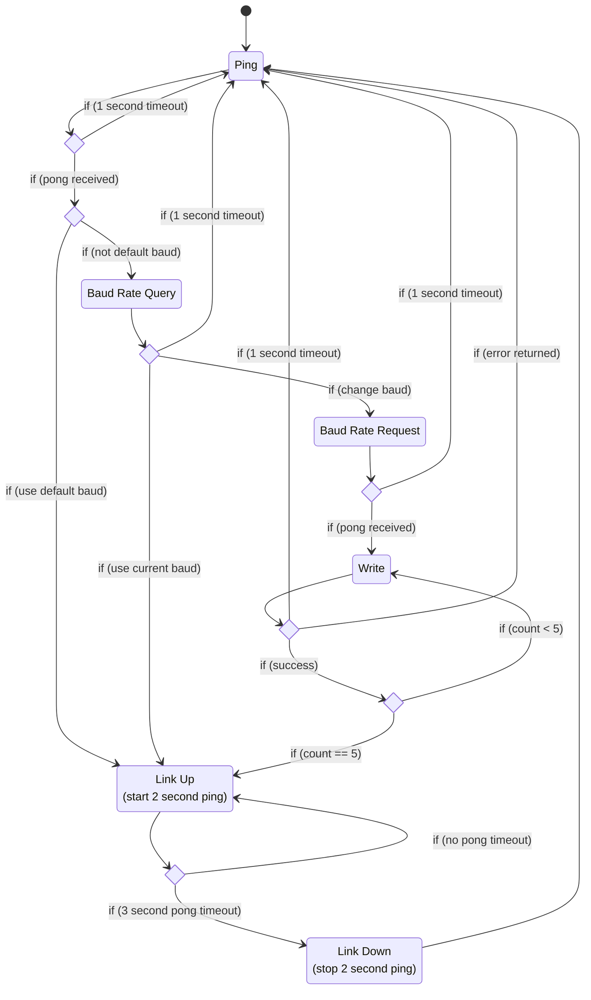
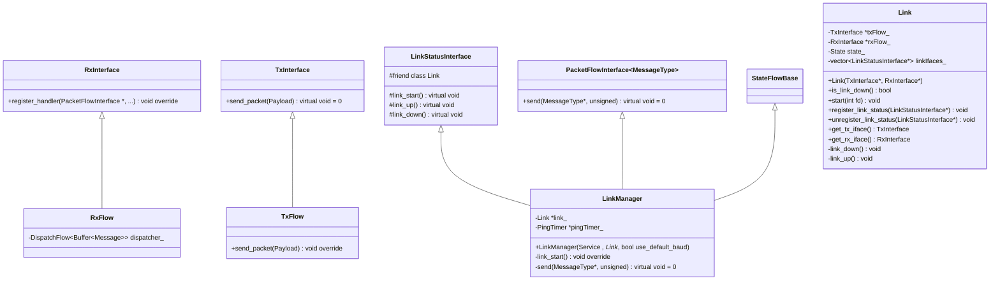
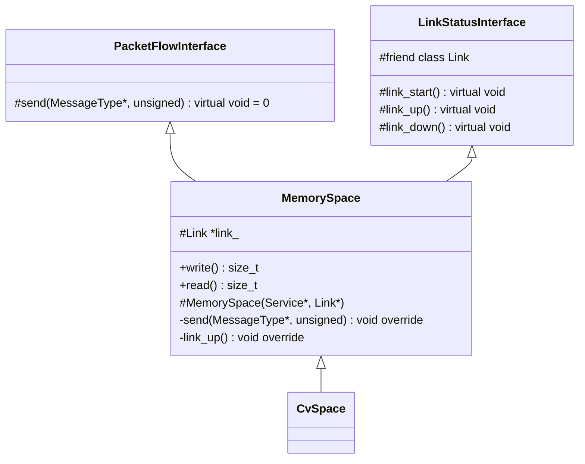
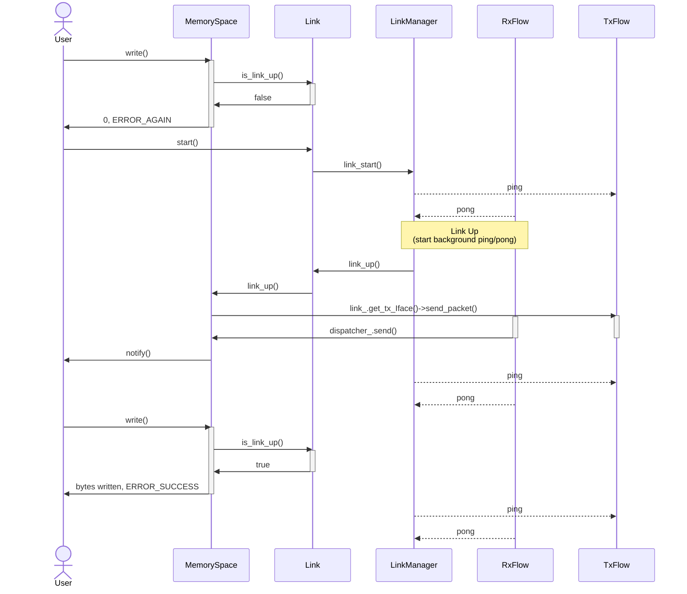

# Traction Modem
Traction modem is a protocol that can be used to exchange typical OpenLCB train information and control over a simple serial interface, typically a UART. Communication is largely peer-to-peer, but link management is performed by the modem side of the interface.

1. [Link Management](#link_management)
2. [Timing](#timing)
3. [Architecture](#architecture)

## Link Management 
The following command types are used for Link management:

| Command                  | Initiator |
|:-------------------------|:---------:|
| Ping                     | Modem     |
| Pong                     | Train     |
| Baud Rate Query          | Modem     |
| Baud Rate Query Response | Train     |
| Baud Rate Request        | Modem     |
| Write                    | Modem     |
| Write Response           | Train     |
| Nop                      | Train     |

To establish a link, the modem performs the following minimum procedure:

It is assumed, by default, that the baud rate will be 250Kbps. The modem may optionally query for additional baud rates that the train may support.

At this point, a new baud rate may optionally be chosen. The sequence includes 5 large dummy writes to the Null address space. These must be responded to without error before the link is established.

The following state machine for link management is implemented in Link.hxx by the LinkManager object on the modem side:

## Timing 
In general, the following link timings should be adhered to:

| Parameter                     | Value | Units |
|:------------------------------|:-----:|:-----:|
| Modem RX Timeout              | 3     | s     |
| Modem Ping Timeout            | 2     | s     |
| Response Timeout              | 750   | ms    |
| Link Establishment RX Timeout | 1     | s     |

### Modem RX Timeout
The modem must receive at least one ping response (pong) every 3 seconds. Periodic pings facilitate this. A ping from the modem should solicit a pong response from the train in order to reset the modem RX timeout.

### Modem Idle Ping Timeout
While the link is in the "up" state, the modem shall send a ping every 2 seconds.

### Response Timeout
For any message that requires a response, the peer shall begin responding within 750 milliseconds.

### Link Establishment Timeout
In order to help facilitate faster link establishment, the RX timeout is shortened in the link establishment phase before the link is "up".

## Architecture 
These architecture diagrams are highly simplified versions of the underlying implementation.

### Generic Message Handling
The following diagram shows the high level class hierarchy for generic message transmission and reception. The Link object handles the [Link Management](#link_management) through an internal state machine.

### Specialized Message Handling
The MemorySpace object(s) are provided as an example.

The following provides and example call sequence for writing a memory space. Link starts down, then later comes up and is interspersed with background pings.

